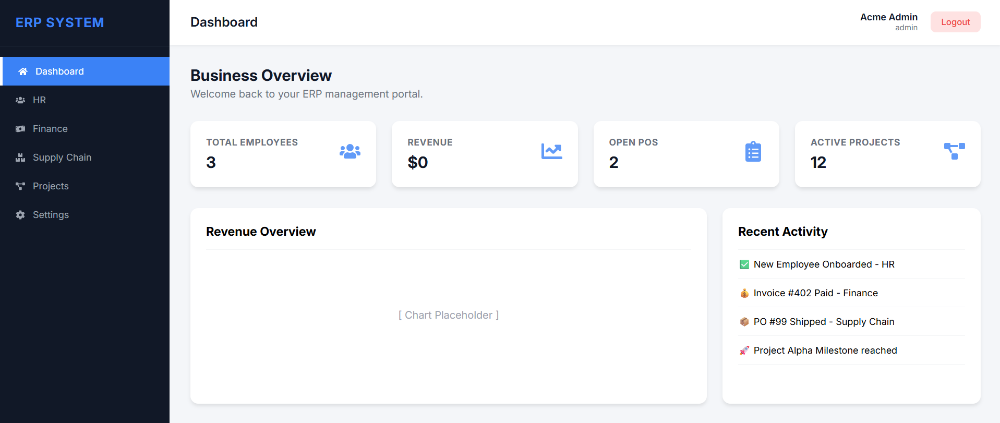
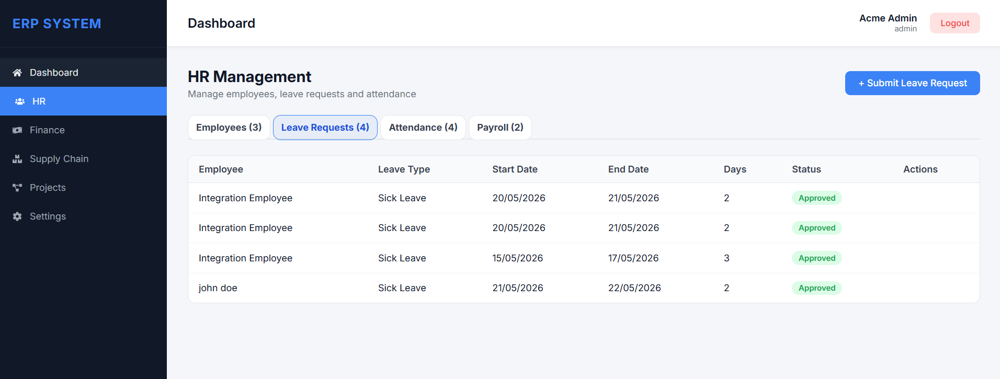
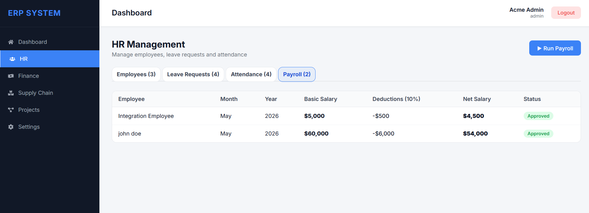
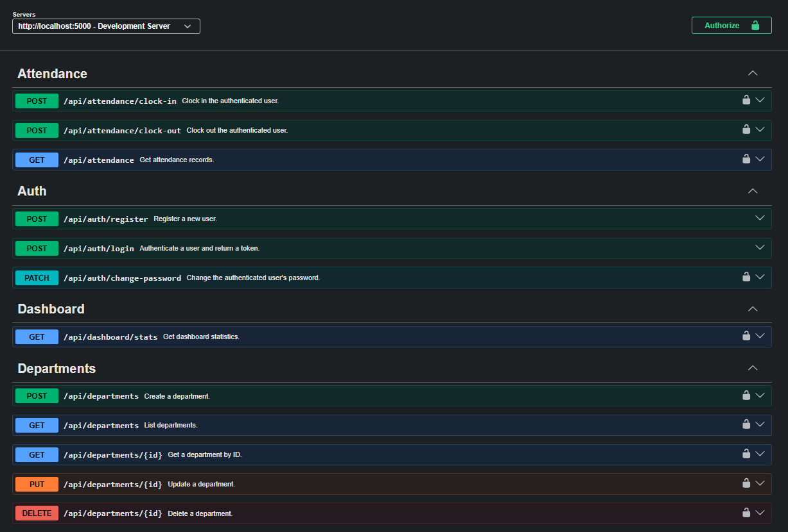

# 🏢 Business ERP System

## 📋 Project Overview

The **Business ERP System (Amdox)** is a modern, multi-tenant Enterprise Resource Planning platform built with the **MERN stack** (MongoDB, Express.js, React, Node.js). Designed for scalability and role-based access control, this system provides organizations with comprehensive modules for **Human Resources management, Payroll processing, Leave administration, Attendance tracking, Financial accounting (General Ledger), Invoicing, and Project management**.

This application demonstrates enterprise-grade architecture with tenant isolation, JWT-based authentication, and a fully documented REST API. Perfect for small to medium-sized organizations seeking a flexible, cloud-ready ERP solution.

---

## 🛠️ Tech Stack

| Category | Technology | Version | Purpose |
|----------|-----------|---------|---------|
| **Frontend** | React | 18.x | UI framework with component-based architecture |
| **Frontend** | Vite | Latest | Fast build tool and dev server |
| **Frontend** | React Router | 6.x | Client-side routing |
| **Frontend** | Axios | Latest | HTTP client for API communication |
| **Backend** | Node.js | 16+ | JavaScript runtime |
| **Backend** | Express.js | 4.x | Minimalist web framework |
| **Backend** | MongoDB | Latest | NoSQL document database |
| **Backend** | Mongoose | 7.x | MongoDB object modeling |
| **Authentication** | JWT (jsonwebtoken) | Latest | Stateless token-based auth |
| **API Documentation** | Swagger UI / Swagger JSDoc | Latest | Interactive API documentation |
| **Utilities** | CORS | Latest | Cross-Origin Resource Sharing |
| **Environment** | dotenv | Latest | Environment variable management |

---

## 🏗️ Architecture Overview

### System Design

The Business ERP System follows a **three-tier architecture** with clear separation of concerns:

```
┌─────────────────────────────────────────────────────────┐
│                    FRONTEND (React)                      │
│         (Dashboard, HR, Finance, Projects, etc.)         │
│                   Port: 5173 (Vite)                      │
└────────────────┬────────────────────────────────────────┘
								 │ HTTP/REST with JWT Tokens
								 │
┌────────────────▼────────────────────────────────────────┐
│                   BACKEND (Express.js)                   │
│              RESTful API Endpoints (Port: 5000)          │
│                                                          │
│  ├─ Authentication Module (JWT)                         │
│  ├─ HR & Payroll Module (Employees, Departments)        │
│  ├─ Attendance Module (Clock-in/out tracking)           │
│  ├─ Leave Management (Requests, Types, Approvals)       │
│  ├─ Financial Module (General Ledger, Accounts)         │
│  ├─ Invoicing Module (Create, aging reports)            │
│  ├─ Project Management (Projects, Milestones)           │
│  ├─ Inventory Management (Stock tracking)               │
│  └─ Vendor & Purchase Orders                            │
└────────────────┬────────────────────────────────────────┘
								 │ Mongoose ODM
								 │
┌────────────────▼────────────────────────────────────────┐
│               DATABASE (MongoDB)                         │
│           Collection-based Data Storage                  │
│         (Users, Employees, Invoices, etc.)              │
└─────────────────────────────────────────────────────────┘
```

### Security & Access Control

**Role-Based Access Control (RBAC):**
- **Admin Role**: Full access to all modules, configuration, and user management
- **Employee Role**: Limited access to personal data, leave requests, and project assignments
- **Tenant Isolation**: Multi-tenant architecture ensures data segregation at the application level

**Authentication Flow:**
1. User logs in with email/password → Backend validates credentials
2. Server issues a **JWT token** (Bearer token) stored in client
3. Subsequent requests include the token in the `Authorization` header
4. Express middleware validates the token before processing requests
5. Role-based middleware enforces endpoint access policies

**Data Security:**
- Passwords are securely hashed before storage
- JWT tokens expire after a configurable duration
- All API endpoints enforce authentication and authorization checks
- CORS is configured to prevent unauthorized cross-origin requests

---

## 📸 Screenshots

### Dashboard


### HR Module


<!-- ### Swagger API Documentation -->
<!--  -->

<!-- ### General Ledger (Finance Module)
 -->

### Payroll Management


### Swagger API Documentation


---

## ⚙️ Local Setup Instructions

### Prerequisites
- **Node.js** (v16 or higher)
- **npm** or **yarn** package manager
- **MongoDB** (local or MongoDB Atlas connection)
- **Git** for version control

### Step 1: Clone the Repository
```bash
git clone https://github.com/yourusername/business-erp-system.git
cd business-erp-system
```

### Step 2: Backend Setup
```bash
cd backend

# Install dependencies
npm install

# Create .env file (see Environment Variables section below)
cp .env.example .env

# Edit .env with your configuration
nano .env

# Start the backend development server
npm run dev
```

The backend will run on **http://localhost:5000**

### Step 3: Frontend Setup
```bash
cd ../frontend

# Install dependencies
npm install

# Start the Vite development server
npm run dev
```

The frontend will run on **http://localhost:5173**

### Step 4: Access the Application
- **Application**: http://localhost:5173
- **API Documentation (Swagger)**: http://localhost:5000/api-docs (development only)
- **Backend API**: http://localhost:5000/api/*

### Running Both Servers Concurrently (Optional)
From the project root, you can use a tool like **concurrently**:

```bash
npm install -g concurrently

# From the project root directory
concurrently "cd backend && npm run dev" "cd frontend && npm run dev"
```

---

## 🔐 Environment Variables

### Backend `.env` Configuration

Create a `.env` file in the `backend/` directory with the following variables:

| Variable | Description | Example Value |
|----------|-------------|----------------|
| `PORT` | Express.js server port | `5000` |
| `MONGO_URI` | MongoDB connection string | `mongodb://127.0.0.1:27017/erp-db` |
| `JWT_SECRET` | Secret key for JWT token signing | `your_super_secret_key_12345` |
| `NODE_ENV` | Environment mode | `development` or `production` |
| `CORS_ORIGIN` | Allowed frontend origin for CORS | `http://localhost:5173` |

### Example `.env` File
```env
PORT=5000
MONGO_URI=mongodb://127.0.0.1:27017/erp-db
JWT_SECRET=your_super_secret_jwt_key_change_in_production_12345
NODE_ENV=development
CORS_ORIGIN=http://localhost:5173
```

### Important Security Notes
- ⚠️ **Never commit `.env` files to version control**
- Change `JWT_SECRET` to a strong random string in production
- Use MongoDB Atlas for production deployments instead of local MongoDB
- Rotate `JWT_SECRET` periodically for enhanced security
- Set `NODE_ENV=production` when deploying to production

---

## 📡 API Endpoints Summary

The Business ERP System provides a comprehensive REST API with 50+ endpoints. Full interactive documentation is available at **`/api-docs`** when running in development mode.

### Core Module Endpoints

#### 🔑 **Authentication Module** (`/api/auth`)
| Method | Endpoint | Description | Auth Required |
|--------|----------|-------------|----------------|
| POST | `/register` | Register a new user account | ❌ No |
| POST | `/login` | Authenticate and receive JWT token | ❌ No |
| PATCH | `/change-password` | Update user password | ✅ Yes |

#### 👥 **HR & Employees Module** (`/api/employees`)
| Method | Endpoint | Description | Auth Required |
|--------|----------|-------------|----------------|
| POST | `/` | Create new employee (Admin only) | ✅ Yes (Admin) |
| GET | `/` | List all employees | ✅ Yes |
| GET | `/:id` | Get employee details by ID | ✅ Yes |
| PUT | `/:id` | Update employee record (Admin only) | ✅ Yes (Admin) |
| DELETE | `/:id` | Delete employee (Admin only) | ✅ Yes (Admin) |

#### 🏢 **Departments Module** (`/api/departments`)
| Method | Endpoint | Description | Auth Required |
|--------|----------|-------------|----------------|
| POST | `/` | Create department (Admin only) | ✅ Yes (Admin) |
| GET | `/` | List all departments | ✅ Yes |
| GET | `/:id` | Get department details | ✅ Yes |
| PUT | `/:id` | Update department (Admin only) | ✅ Yes (Admin) |
| DELETE | `/:id` | Delete department (Admin only) | ✅ Yes (Admin) |

#### 🕐 **Attendance Module** (`/api/attendance`)
| Method | Endpoint | Description | Auth Required |
|--------|----------|-------------|----------------|
| POST | `/clock-in` | Record clock-in time | ✅ Yes |
| POST | `/clock-out` | Record clock-out time | ✅ Yes |
| GET | `/` | Retrieve attendance records | ✅ Yes |

#### 📅 **Leave Management Module** (`/api/leaves`)
| Method | Endpoint | Description | Auth Required |
|--------|----------|-------------|----------------|
| POST | `/leave-types` | Create leave type (Admin only) | ✅ Yes (Admin) |
| GET | `/leave-types` | List leave types | ✅ Yes |
| POST | `/request` | Submit a leave request | ✅ Yes |
| GET | `/request/me` | Get my leave requests | ✅ Yes |
| GET | `/request` | List all leave requests (Admin) | ✅ Yes (Admin) |
| PATCH | `/request/:id/approve` | Approve leave request (Admin) | ✅ Yes (Admin) |
| PATCH | `/request/:id/reject` | Reject leave request (Admin) | ✅ Yes (Admin) |

#### 💰 **Financial Module - General Ledger** (`/api/gl`)
| Method | Endpoint | Description | Auth Required |
|--------|----------|-------------|----------------|
| POST | `/accounts` | Create chart of accounts entry | ✅ Yes (Admin) |
| GET | `/accounts` | List all accounts | ✅ Yes |
| GET | `/accounts/:id` | Get account details | ✅ Yes |
| PUT | `/accounts/:id` | Update account (Admin only) | ✅ Yes (Admin) |
| DELETE | `/accounts/:id` | Delete account (Admin only) | ✅ Yes (Admin) |
| POST | `/journal-entries` | Create journal entry (Admin only) | ✅ Yes (Admin) |
| GET | `/journal-entries` | List journal entries | ✅ Yes |
| GET | `/journal-entries/:id` | Get journal entry details | ✅ Yes |
| POST | `/periods` | Create accounting period (Admin) | ✅ Yes (Admin) |
| GET | `/periods` | List periods | ✅ Yes |
| PATCH | `/periods/:id/close` | Close accounting period (Admin) | ✅ Yes (Admin) |

#### 📄 **Invoicing Module** (`/api/invoices`)
| Method | Endpoint | Description | Auth Required |
|--------|----------|-------------|----------------|
| POST | `/` | Create invoice (Admin only) | ✅ Yes (Admin) |
| GET | `/` | List invoices | ✅ Yes |
| GET | `/aging-report` | Get invoice aging report (Admin) | ✅ Yes (Admin) |

#### 💳 **Payments Module** (`/api/payments`)
| Method | Endpoint | Description | Auth Required |
|--------|----------|-------------|----------------|
| POST | `/` | Record a payment (Admin only) | ✅ Yes (Admin) |

#### 📊 **Payroll Module** (`/api/payroll`)
| Method | Endpoint | Description | Auth Required |
|--------|----------|-------------|----------------|
| POST | `/run` | Run payroll for period (Admin only) | ✅ Yes (Admin) |
| GET | `/` | List payroll records | ✅ Yes |
| GET | `/:employeeId` | Get employee payroll history (Admin) | ✅ Yes (Admin) |

#### 📦 **Inventory Module** (`/api/inventory`)
| Method | Endpoint | Description | Auth Required |
|--------|----------|-------------|----------------|
| POST | `/` | Add inventory item (Admin only) | ✅ Yes (Admin) |
| GET | `/` | List inventory | ✅ Yes |
| GET | `/low-stock` | Get low-stock items (Admin only) | ✅ Yes (Admin) |
| PUT | `/:id` | Update inventory item (Admin only) | ✅ Yes (Admin) |

#### 🏭 **Vendor Management** (`/api/vendors`)
| Method | Endpoint | Description | Auth Required |
|--------|----------|-------------|----------------|
| POST | `/` | Create vendor (Admin only) | ✅ Yes (Admin) |
| GET | `/` | List vendors | ✅ Yes |

#### 📋 **Purchase Orders** (`/api/purchase-orders`)
| Method | Endpoint | Description | Auth Required |
|--------|----------|-------------|----------------|
| POST | `/` | Create purchase order (Admin only) | ✅ Yes (Admin) |
| GET | `/` | List purchase orders | ✅ Yes |
| PATCH | `/:id/deliver` | Mark as delivered (Admin only) | ✅ Yes (Admin) |

#### 📌 **Projects Module** (`/api/projects`)
| Method | Endpoint | Description | Auth Required |
|--------|----------|-------------|----------------|
| POST | `/` | Create project (Admin only) | ✅ Yes (Admin) |
| GET | `/` | List projects | ✅ Yes |
| GET | `/:id` | Get project details | ✅ Yes |
| PUT | `/:id` | Update project (Admin only) | ✅ Yes (Admin) |
| DELETE | `/:id` | Delete project (Admin only) | ✅ Yes (Admin) |
| POST | `/:projectId/milestones` | Add milestone (Admin only) | ✅ Yes (Admin) |
| GET | `/:projectId/milestones` | List milestones | ✅ Yes |
| PATCH | `/:projectId/milestones/:milestoneId/complete` | Mark milestone complete (Admin) | ✅ Yes (Admin) |

#### 🏥 **Health Check** (`/api/health`)
| Method | Endpoint | Description | Auth Required |
|--------|----------|-------------|----------------|
| GET | `/` | Check API and database connectivity | ❌ No |

### Interactive API Documentation

**Swagger UI** provides a user-friendly interface to explore, test, and understand all available endpoints:

```
http://localhost:5000/api-docs
```

The Swagger documentation includes:
- 📝 Detailed endpoint descriptions and parameters
- 🔐 Security schemes and authentication requirements
- 📤 Request body examples with realistic data
- 📥 Response examples and error codes
- 🧪 "Try it out" functionality to test endpoints directly

---

## 📁 Project Structure

```
business-erp-system/
├── backend/
│   ├── config/
│   │   └── swagger.js              # Swagger documentation setup
│   ├── controllers/                # Business logic handlers
│   │   ├── authController.js
│   │   ├── employeeController.js
│   │   ├── attendanceController.js
│   │   ├── payrollController.js
│   │   ├── accountController.js    # General Ledger
│   │   ├── journalEntryController.js
│   │   ├── invoiceController.js
│   │   └── ... (more controllers)
│   ├── middleware/
│   │   ├── authMiddleware.js       # JWT verification
│   │   ├── roleMiddleware.js       # Role-based access control
│   │   └── errorMiddleware.js      # Centralized error handling
│   ├── models/                     # Mongoose schemas
│   │   ├── User.js
│   │   ├── Employee.js
│   │   ├── Invoice.js
│   │   ├── Account.js              # Chart of Accounts
│   │   ├── JournalEntry.js
│   │   └── ... (more models)
│   ├── routes/                     # API route definitions
│   │   ├── authRoutes.js
│   │   ├── employeeRoutes.js
│   │   ├── attendanceRoutes.js
│   │   ├── glRoutes.js             # General Ledger routes
│   │   ├── invoiceRoutes.js
│   │   └── ... (more routes)
│   ├── utils/
│   │   └── response.js             # Standardized response formatter
│   ├── server.js                   # Express app entry point
│   ├── package.json
│   └── .env                        # Environment variables (create locally)
├── frontend/
│   ├── src/
│   │   ├── features/
│   │   │   ├── auth/               # Authentication components
│   │   │   ├── hr/                 # HR module components
│   │   │   └── ... (feature modules)
│   │   ├── pages/
│   │   │   ├── Dashboard.jsx
│   │   │   ├── HR.jsx
│   │   │   ├── Finance.jsx
│   │   │   ├── Projects.jsx
│   │   │   └── ... (page components)
│   │   ├── routes/
│   │   │   └── AppRoutes.jsx       # React Router configuration
│   │   ├── shared/                 # Shared components
│   │   ├── App.jsx
│   │   └── main.jsx                # React entry point
│   ├── package.json
│   ├── vite.config.js
│   └── index.html
├── postman/
│   ├── collections/                # Postman API collections
│   └── globals/
├── README.md                        # This file
├── package.json                     # Root package.json (for monorepo)
└── .gitignore
```

---

## 🚀 Deployment Guide

### Backend Deployment (Node.js)
- Deploy to platforms like **Heroku**, **Railway**, **Render**, or **AWS EC2**
- Ensure `NODE_ENV=production` is set
- Use **MongoDB Atlas** for managed database hosting
- Configure CORS for your production frontend domain
- Use a process manager like **PM2** for production stability

### Frontend Deployment (React + Vite)
- Build production bundle: `npm run build`
- Deploy to **Vercel**, **Netlify**, **GitHub Pages**, or **AWS S3 + CloudFront**
- Update API endpoint to production backend URL in environment config
- Enable HTTPS for secure communication

---

## 📚 Features & Modules

✅ **Multi-Tenant Architecture** - Isolated data per organization
✅ **Role-Based Access Control** - Admin and Employee roles with fine-grained permissions
✅ **HR Management** - Employee profiles, departments, organizational structure
✅ **Payroll System** - Automated payroll processing and salary calculations
✅ **Attendance Tracking** - Clock-in/out system with attendance reports
✅ **Leave Management** - Leave type configuration, request workflow, approval system
✅ **General Ledger** - Chart of accounts, journal entries, accounting periods
✅ **Invoicing** - Create invoices, aging reports, payment tracking
✅ **Inventory Management** - Stock tracking, low-stock alerts, reorder levels
✅ **Vendor Management** - Vendor profiles, contact information
✅ **Purchase Orders** - Order creation, delivery tracking
✅ **Project Management** - Project creation, milestone tracking
✅ **Dashboard Analytics** - Real-time statistics and KPI visualization
✅ **JWT Authentication** - Secure token-based authentication
✅ **Swagger API Documentation** - Interactive API explorer

---

## 🔍 Testing the API

### Using Postman
1. Import the Postman collection from `postman/collections/Amdox ERP System.postman_collection.json`
2. Set up the workspace globals with your API base URL
3. Test endpoints with pre-configured requests

### Using cURL
```bash
# Admin : Owner of the Project who has access to all departments
   Email: admin@acme.com
   Password: password123
# Register a new user
curl -X POST http://localhost:5000/api/auth/register \
	-H "Content-Type: application/json" \
	-d '{
		"name": "John Doe",
		"email": "john@example.com",
		"password": "SecurePass123!"
	}'

# Login and get JWT token
curl -X POST http://localhost:5000/api/auth/login \
	-H "Content-Type: application/json" \
	-d '{
		"email": "john@example.com",
		"password": "SecurePass123!"
	}'

# Access protected endpoint with token
curl -X GET http://localhost:5000/api/employees \
	-H "Authorization: Bearer YOUR_JWT_TOKEN_HERE"
```

---

## 🐛 Troubleshooting

### Issue: Backend fails to connect to MongoDB
**Solution:**
- Verify MongoDB is running locally: `mongod`
- Check `MONGO_URI` in `.env` is correct
- Ensure MongoDB port (27017) is not blocked by firewall

### Issue: CORS errors when accessing from frontend
**Solution:**
- Verify `CORS_ORIGIN` in backend `.env` matches frontend URL
- Check that frontend is running on the correct port (5173)

### Issue: JWT token is invalid or expired
**Solution:**
- Logout and login again to get a fresh token
- Check that `JWT_SECRET` is consistent
- Verify token is sent in the correct format: `Authorization: Bearer <token>`

### Issue: Swagger docs not appearing
**Solution:**
- Ensure `NODE_ENV=development` is set
- Verify backend is running on port 5000
- Check that `/api-docs` endpoint is accessible

---

## 📝 License

This project is provided for educational and academic purposes. All rights reserved.

---

## 👥 Team & Contributors

### Core Developer & Authors
- **Sohail Ahmad**
  - Role: Full-Stack Developer
	- Responsibilities: Complete system design, architecture, backend development
- **Madhu Smita** 
  - Role: Full-Stack Developer
	- Responsibilities: Managing both Frontend and Backend,Handling Team 
- **Tanzeela Firdous**
- - Role: Frontend Developer
	- Responsibilities: Managing Frontend UI,Handling Team 
- **Nityashri**
	- Role: Frontend Developer
	- Responsibilities: Managng Frontend UI 

---

## 📞 Support & Contact

For questions, issues, or suggestions regarding this project, please reach out to the development team.

---

## ✨ Acknowledgments

This Business ERP System was developed as a comprehensive demonstration of modern full-stack web development using the MERN stack, with emphasis on enterprise-grade architecture, security best practices, and professional API documentation standards.

---

**Last Updated:** May 12, 2026  
**Version:** 1.0.0  
**Status:** Production Ready ✅

